# 🔐 Lab Frida — Android Root Detection Bypass

Lab de sécurité mobile démontrant le contournement des mécanismes de détection de root Android à l'aide de Frida, couvrant les couches Java (RootBeer, Build.TAGS, File.exists, Runtime.exec) et native (open/access/stat/openat via JNI).

**Stack** : Frida 16.1.4 · Android x86_64 Emulator · ADB · Python 3

---

## Table des matières

1. [Installation et preuve](#1-installation-et-preuve-20-pts)
2. [Déploiement et visibilité](#2-déploiement-et-visibilité-30-pts)
3. [Bypass Java](#3-bypass-java-30-pts)
4. [Natif / Trace](#4-natiftrace-20-pts)

---

## 1. Installation et preuve (20 pts)

```bash
frida --version          # 16.1.4
py -c "import frida; print(frida.__version__)"   # 16.1.4
adb devices              # emulator-5554   device
```

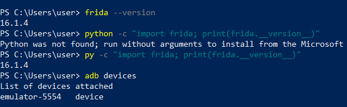

---

## 2. Déploiement et visibilité (30 pts)

### 2.1 Push et démarrage de frida-server

```bash
adb shell "rm -rf /data/local/tmp/frida-server"
adb push "frida-server-16.1.4-android-x86_64\frida-server" /data/local/tmp/frida-server
adb shell "chmod +x /data/local/tmp/frida-server"
adb shell /data/local/tmp/frida-server
```

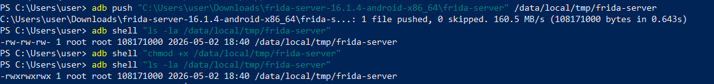

### 2.2 Liste des applications

```bash
frida-ps -Uai
```

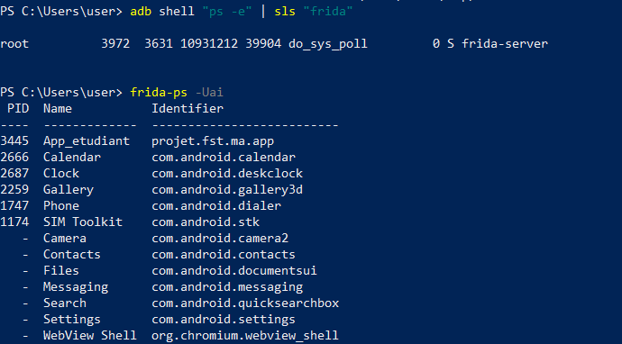

---

## 3. Bypass Java (30 pts)

### 3.1 Installation de RootBeer Sample

```bash
adb install RootBeerSample.apk
```

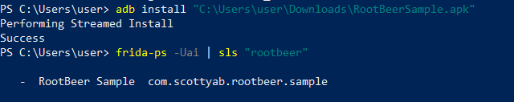

### 3.2 État AVANT le bypass

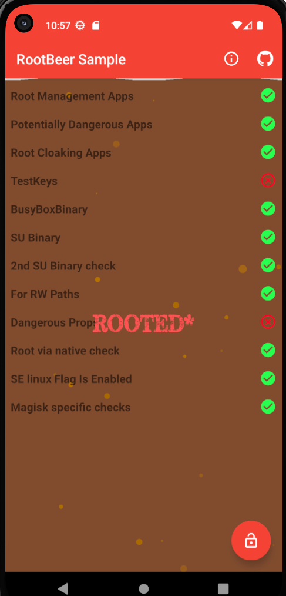

> L'app affiche **ROOTED*** — tous les checks détectent le root.

### 3.3 Lancement du bypass Java

```bash
frida -U -f com.scottyab.rootbeer.sample -l bypass_root.js
```

Logs obtenus :
```
[+] Hook Build.TAGS -> release-keys
[+] Hooks Runtime.exec installés
[+] Java layer bypass installed
[+] Build.TAGS value set
[+] File.exists bypass for /system/bin/busybox
[+] File.exists bypass for /system/xbin/busybox
[+] File.exists bypass for /sbin/su
[+] File.exists bypass for /system/bin/su
[+] File.exists bypass for /system/xbin/su
[+] Blocked Runtime.exec: which su
```

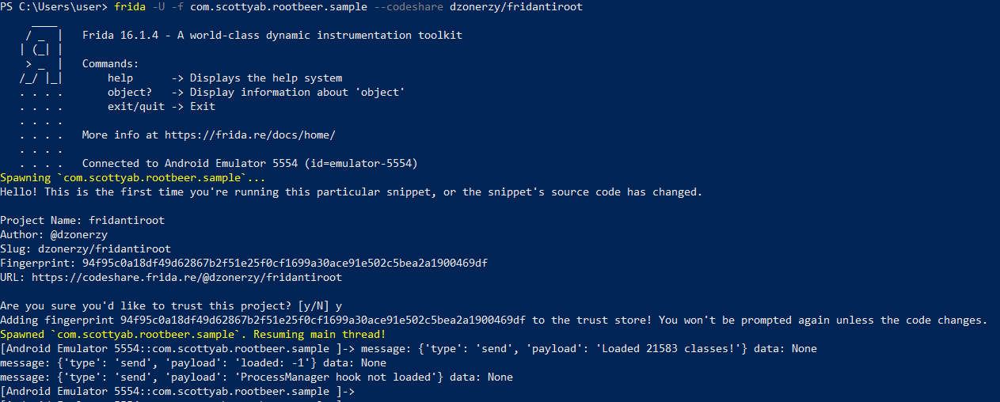

### 3.4 État APRÈS le bypass

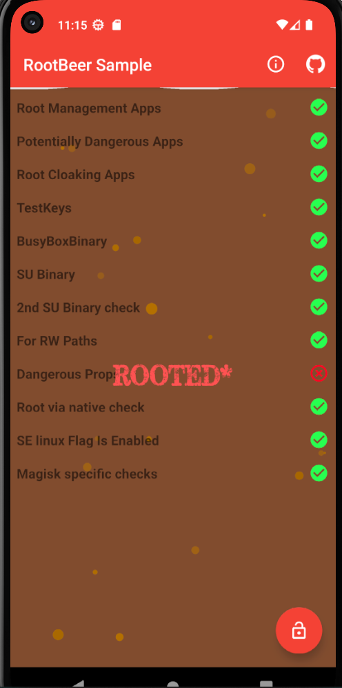

> Les checks **BusyBox Binary**, **SU Binary**, **Build.TAGS**, **Runtime.exec** et **File.exists** sont bypassés.

> ⚠️ Le check *Dangerous Props* reste détecté car `ro.debuggable` et `ro.secure` sont hardcodées au niveau kernel sur l'émulateur standard.

---

## 4. Natif/Trace (20 pts)

### 4.1 Identification des appels natifs

```bash
frida-trace -U -f com.scottyab.rootbeer.sample -i open -i access -i stat -i openat
```

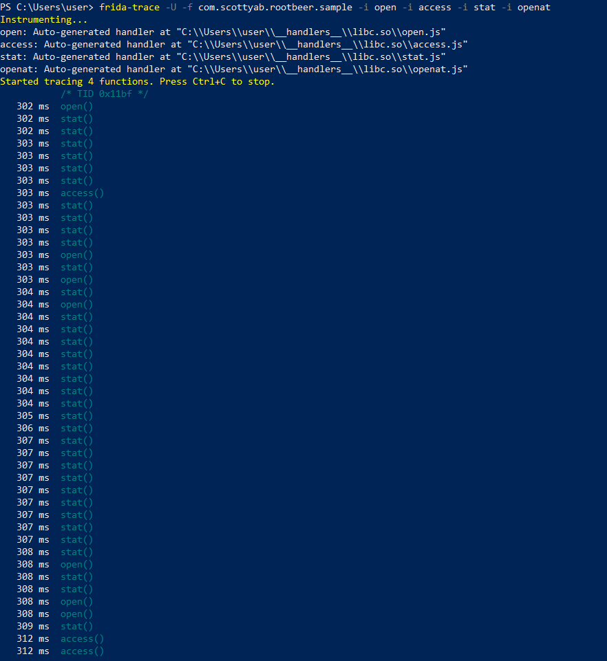

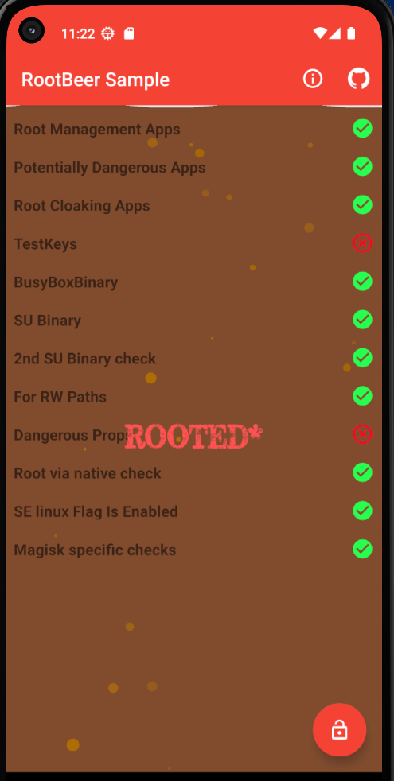

### 4.2 Bypass natif combiné

```bash
frida -U -f com.scottyab.rootbeer.sample -l bypass_root.js -l bypass_native.js
```

Logs obtenus :
```
[+] Hooked open
[+] Hooked openat
[+] Hooked access
[+] Hooked stat
[+] Hooked lstat
[+] Blocked open on /sbin/su
[+] Blocked open on /system/bin/su
[+] Blocked open on /system/xbin/su
```

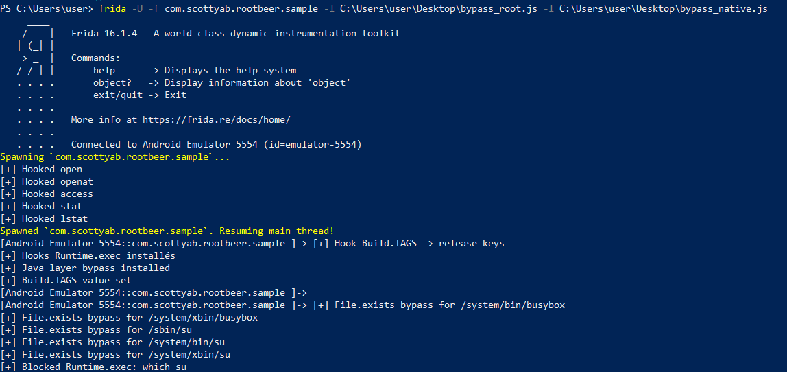

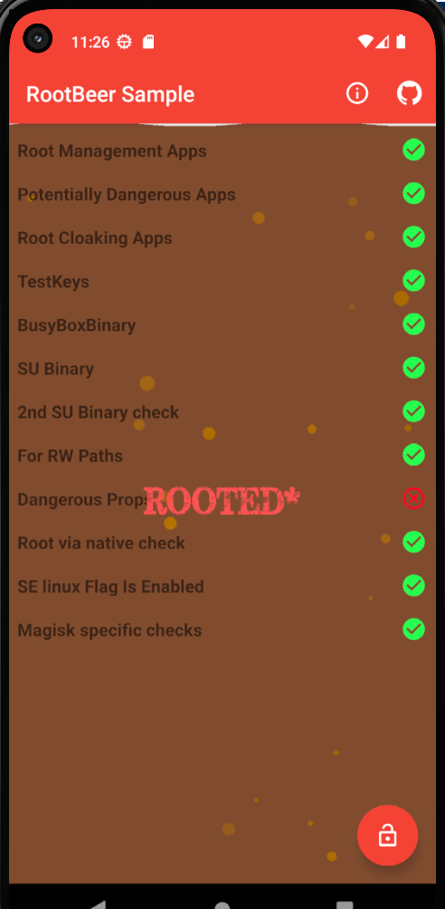

---

## Arborescence du repo

```
frida-root-bypass/
├── bypass_root.js
├── bypass_native.js
├── README.md
└── screens/
    ├── 01_installation.png
    ├── 02_frida_server_start.png
    ├── 03_frida_ps_uai.png
    ├── 04_rootbeer_install.png
    ├── 05_before_bypass.png
    ├── 06_lancement_du_bypass.png
    ├── 07_after_bypass.png
    ├── 08_frida_trace.png
    ├── 09_frida_trace_emulator.png
    ├── 10_bypass_native.png
    └── 11_bypass_native_result.png
```

---

## Récapitulatif des points

| Partie | Points | Critère | Statut |
|---|---|---|---|
| Installation | 20 pts | `frida --version` + python + `adb devices` | ✅ |
| Déploiement | 30 pts | frida-server actif + ≥3 apps listées | ✅ |
| Bypass Java | 30 pts | Logs `[+]` + avant/après RootBeer | ✅ |
| Natif/Trace | 20 pts | ≥2 appels natifs + logs `[+] Blocked` | ✅ |
